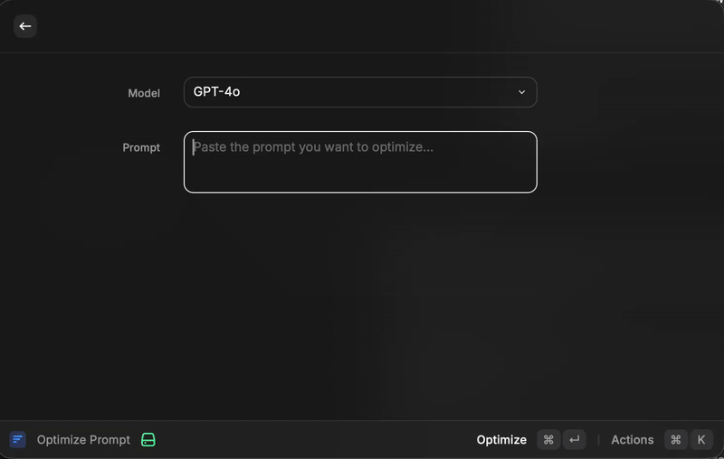

# Prompt Optimizer

Rewrite and improve prompts for reliable use with AI tools and agents.

## Overview

Prompt Optimizer is a Raycast extension that helps you turn rough ideas into clear, structured prompts. It focuses on improving intent, constraints, and output format so your AI tools return more predictable results. It only rewrites your prompt and can ask clarifying questions; it never executes the task for you.

## What you get

- Clearer prompts with explicit goals, constraints, and success criteria
- Structured output expectations (format, tone, and level of detail)
- Optional clarifying questions to refine the result
- Fast retries when you want a different wording or emphasis

## Demo

## When to use it

- You have a vague or messy prompt and want a cleaner version
- You need consistent output format for tooling or automation
- You want to reduce back-and-forth with AI assistants
- You want the same request tailored to a specific target model

## Usage

- Run the command `Optimize Prompt`
- Choose a target model and paste the prompt you want to optimize
- Submit to receive an optimized prompt
- You can improve the optimized prompt further by answering clarifying questions (⌘+Enter)
- You can retry optimization if the result is not satisfactory (⌘+K → Retry Optimization)

## Tips

- Include the goal, audience, and output format in the original prompt
- Add hard constraints (length, tone, structure) if they matter
- If the optimized prompt feels off, answer the clarifying questions and retry

## References

- [OpenAI Prompt Editor](https://platform.openai.com/chat/edit?models=gpt-5&optimize=true)
- [OpenAI Cookbook guidelines](https://cookbook.openai.com/)

## Requirements

- The optimizer uses OpenAI Responses API with a system prompt and user payload, openai API key is required.
- Use of OpenAI APIs must comply with OpenAI's Terms of Use.
